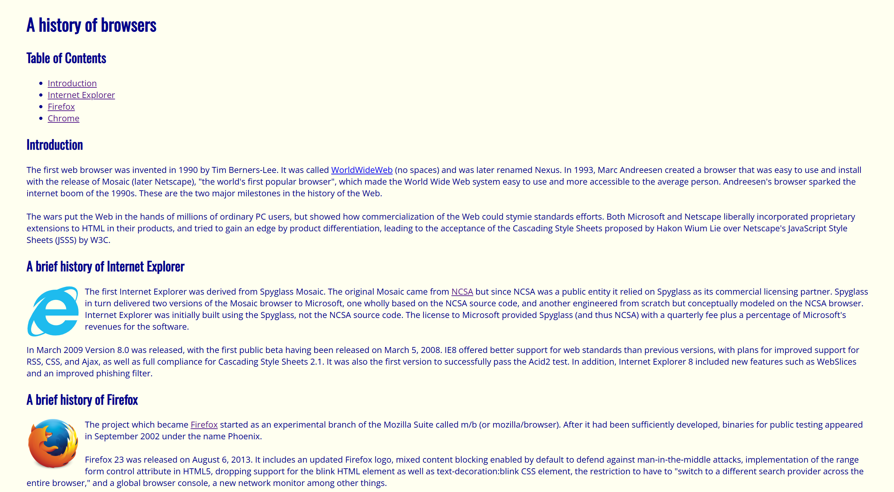
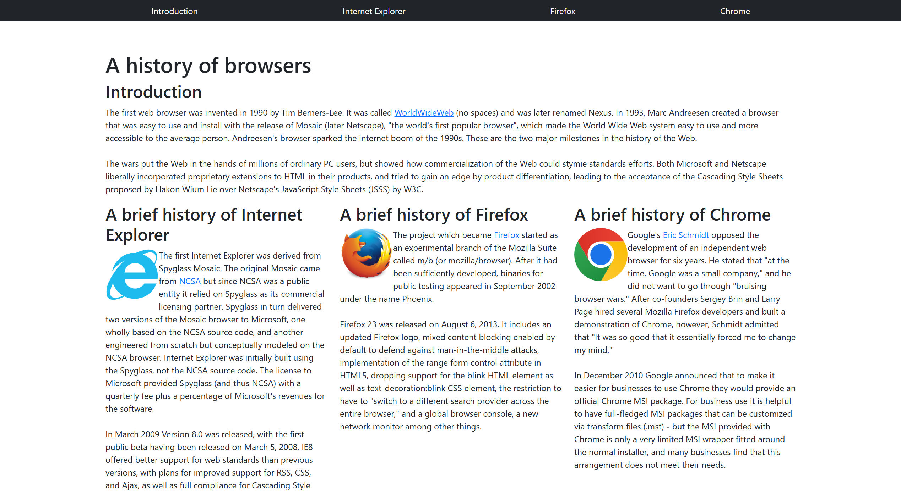

Designing a website isn’t always easy as everyone seems to assume it is. It requires lots of effort to get all the contents, buttons, images, navigation bars, etc… to be placed according to the developer’s vision. And implementing all of these in pure HTML and CSS codes, although possible, for the person behind doing all of this tedious amount of work, however, would take close to forever to get the first version done. Having to manually configure the correct HTML tags and CSS attributes to fit your needs may lead to massive amounts of lines of code, and it is exhausting to navigate through the files just to find the button you want to change within a field of diverse tags.


At this point, a developer should be asking themself is there a quicker way to get these things done so that they don’t have to sit for hours on end trying to center a div or perfecting their navigation bar. Learning how to build a website should be fun, but should not be about writing repetitive codes that barely make a visual difference. Hence, modern frameworks built for styling websites are introduced, and the one that I’m working and enjoying myself with is Bootstrap 5. It is the equivalent of having a professional designer by your side, guiding your layout and styling choices so you can focus more on the core functionality of your application and not working up from scratch.

# Forming a Shortcut

Take a following look at this sample HTML code with Bootstrap 5 implemented as an example:

```
<nav class="navbar navbar-expand-lg navbar-dark bg-dark rounded">
  <div class="container-fluid">
    <button class="navbar-toggler" type="button" data-bs-toggle="collapse" data-bs-target="#navbarNav">
      <span class="navbar-toggler-icon"></span>
    </button>
    <div class="collapse navbar-collapse" id="navbarNav">
      <ul class="navbar-nav ms-auto">
        <li class="nav-item"><a class="nav-link active" href="#">Home</a></li>
        <li class="nav-item"><a class="nav-link" href="#">Projects</a></li>
        <li class="nav-item"><a class="nav-link" href="#">Contacts</a></li>
      </ul>
    </div>
  </div>
</nav>
```

The functionality of this code is to make the content appear when the dimensions of the website is wide enough, and disappear when they are too small (like the size of a mobile phone for example.) Implementing this with bare CSS would require lots of lines of code since the stylesheet was not built to handle “complex” functionalities like mentioned previously. 

Look at how all of the HTML tags are equipped with a respective class. Each keyword in each class, separated by a spacebar, shapes how the website will be presented. For instance,  ```.navbar-expand-lg``` would expand the navigation bar to full window width, and the button tag may either appear or disappear, simply with the ```.navbar-toggler``` keyword. Or how ```.ms-auto``` allows for instant layout adjustments by automatically sets out horizontal and vertical margins for all contents; something that may be taken up with dozens of CSS codes of calculating and measuring the correct positions. 

Bootstrap is so convenient that a fully functional website can be built within its HTML file only. There’s no need to constantly switch between the HTML and CSS files when it's possible to have a framework as practical as Bootstrap 5 that lets you do it with just HTML code. Using a framework is like having a professional designer and engineer working alongside when building a website: it allows the developer to seamlessly customize his platform within a few keywords, cutting off a large portion of time that may have been spent on designing alone if there was no framework present.

<div class="text-center p-3">
  <figure>
    
    <figcaption><i>A website built with HTML and CSS</i></figcaption>
  </figure>
  
  <figure>
    
    <figcaption><i>Same website but implemented with Bootstrap and no CSS</i></figcaption>
  </figure>
</div>

# Utilize UI Frameworks

Transitioning from pure CSS to a modern framework like Bootstrap 5 represents a significant leap in developer productivity and design consistency. With its robust library of pre-built components, Bootstrap removes the tedious work and repetitive CSS coding that were once the only options. The ease of implementing a fully responsive UI element off a framework allows developers to solely focus on the core functionality of their applications. Using a UI framework isn’t just about writing less code; it’s about creating a smooth, high-quality user experience on all devices. These qualities define web development today.
