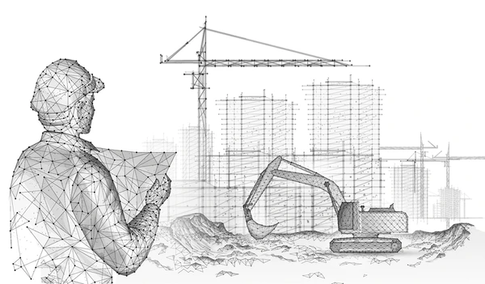

When an architect arrives at an empty plot of land, they don’t immediately use the wood planks to build walls and structure of their building that they imagined while doing their job. Instead, they reach for blueprints: they provide assistance to properly construct the building that would solve all the problems building it may have. How are galvanized steel going to support building stability? How to make stairs and elevators safe? What materials are needed to prevent environmental issues from affecting the interiors and exteriors? And various similar questions. These questions are what architects ask themselves before constructing, and build up with solutions to answer them. 



Software engineering operates in a similar manner. When developers are assigned with a project, they need a plan of how they will build their projects over time, instead of doing whatever they want to do not only to keep things organized, but being able to maintain stability of the code base when the instability of their project grows over time. This is where design patterns come into play to operate as a blueprint for a website architecture. They are drawn to capture all problems and solutions, tools needed to make the website works, but can’t code for help's sake: that’s the developer’s responsibility to make it happen! Being able to control and be consistent with the work planned out, just as a builder must adhere to the architect's original vision.

# Proper Implementation

The <a href='https://uh-gamelink.vercel.app/'>final project</a> me and my teammates are working on, supports the basis of the architect's blueprint. For instance, when working with files that involve the API, the ```GET``` function allows a clear and repeatable structure: authenticate the user, get data, and properly respond to display the right things we wanted to see. 

```
export async function GET() {
  try {
    const session = await auth();

    if (!session?.user?.email) {
      return NextResponse.json({ error: 'Unauthorized' }, { status: 401 });
    }

    const user = await prisma.user.findUnique({
      where: { email: session.user.email },
      include: {
        profile: true,
        savedServers: {
          include: {
            server: true,
          },
        },
      },
    });

    if (!user) {
      return NextResponse.json({ error: 'User not found' }, { status: 404 });
    }

    return NextResponse.json(user);

  } catch (error) {
    console.error('Error fetching profile:', error);
    return NextResponse.json({ error: 'Failed to fetch profile' }, { status: 500 });
  }
}
```

Like an inspector verifies the strength of the structure before the walls go up, the use of ```auth()``` command acts as a security perimeter of our Prisma database, ensuring that only authorized "tenants" (users) can access the data within. In the absence of a valid session or email, the code serves as a security gate, freezing all further operations. It keeps the application from failing when someone tries to do something they should not do. By following, the “architect” ensures that our final project is good and safe.

By wrapping the logic in a try-catch block, the developer has installed a safety net to retrieve user’s data. If something goes wrong with a part or a connection is lost when getting data, the system does not crash or leave the user in the dark; instead, it handles the surge and calmly returns a 500 status error. This shows that a good architect does not just plan for things to go well—they also design for the "storms". By ensuring every path leads to a defined response in a fragile structure, the developer maintains the integrity of the entire application, allowing future scalability to occur. 

# Final Inspection

In the world of software development, the transition from a conceptual design to a functional application is rarely a straight line. Hence, we rely on patterns to help us get to our goals easier. They were not just ideas, but actual tools that helped me organize my code, separate tasks and build systems to grow without falling. Design patterns made sure that objects were created in a way that different parts of the system could talk to each other without being too connected and that everything looked consistent. 
