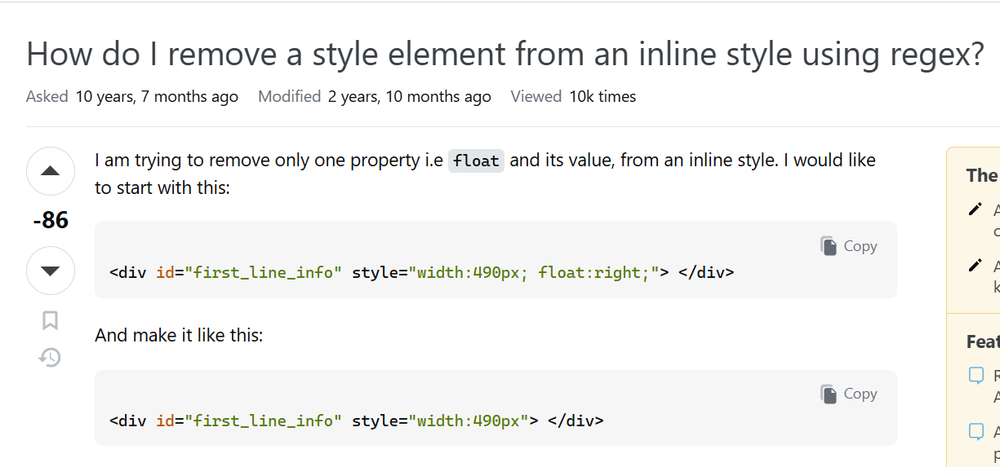

Today, billions of people can access vast amounts of information and knowledge without spending their savings. In addition, they can all be accessed within a short prompt for search on the web, and the result will pop up in less than 10 seconds or less. While access to information has improved, challenges in finding the right information still exist. However, before AI's mainstream adoption in 2022, Google searches often failed to yield the desired results. There arrives forums: any medium that allows people from all corners of the globe to be encouraged in exchanging information based on any certain issue that they happen to have. For coders and developers, StackOverflow is the go-to platform.

​
StackOverflow is a widely recognized platform in the programming community, known for its extensive Q&A format. But what would be included instead is the importance of the questions and asking questions on the page. Eric Raymond, a prominent figure in the open-source community, emphasizes that the quality of an answer is directly tied to the effort put into the question in his essay, "How To Ask Questions The Smart Way." This means that better questions lead to better responses, and the essay supports as an aid to guide curious minds alike to get the answers they needed.
​
## Not-so-smart questions
​
Let’s take the following [battleship game](https://stackoverflow.com/questions/49712980/i-need-help-for-this-program) as an example. The author's post, "I need help with this program," includes the entire problem description and requirements without providing any code or explaining previous attempts. This is not a genuine search for help but rather a request for the community to write the code. Funnily enough, the first comment under this post refuses to help this person because he’s not going to do the asker’s “homework.” Raymond would have categorized the author title to be in the “Stupid” group because it doesn't provide any relevant context for the problem, and would associate it with “time sinks” individuals for the entire post itself.


​
A question about [removing a style element from an inline style using regex](https://stackoverflow.com/questions/30791292/how-do-i-remove-a-style-element-from-an-inline-style-using-regex) rose in popularity due to its negativity. Like the previous example, this question is also a "time sink." The user wanted to remove only one property from his HTML code using regular expressions or regex, coded in C#. Take a look at how he asked this to the community: 



​
​Raymond highlights a critical distinction in his work: “Describe the goal, not the step”. This person failed to comply to this principle by focusing on a specific “step”—using regular expressions—rather than stating their “goal”—modifying a CSS property. The essay also suggests questions similar to these are basically time wasters in hindsight because they force the community to waste their precious free time to answer the user’s flawed premises rather than actually solving the problem.​
​

## Actual smart questions
​
A great example of a smart question based on Raymond’s criteria on Stack Overflow is the following: “[Why is processing a sorted array faster than processing an unsorted array?](https://stackoverflow.com/questions/11227809/why-is-processing-a-sorted-array-faster-than-processing-an-unsorted-array)” The author behind the most upvoted post of the site simply examined how long the code (in C++) takes to return the sum of an array, both sorted and unsorted. Take a look at the following code snippet:

```
int main()
{
    // Generate data
    const unsigned arraySize = 32768;
    int data[arraySize];

    for (unsigned c = 0; c < arraySize; ++c)
        data[c] = std::rand() % 256;

    // !!! With this, the next loop runs faster.
    std::sort(data, data + arraySize);

    // Test
    clock_t start = clock();
    long long sum = 0;
    for (unsigned i = 0; i < 100000; ++i)
    {
        for (unsigned c = 0; c < arraySize; ++c)
        {   // Primary loop.
            if (data[c] >= 128)
                sum += data[c];
        }
    }

    double elapsedTime = static_cast<double>(clock()-start) / CLOCKS_PER_SEC;

    std::cout << elapsedTime << '\n';
    std::cout << "sum = " << sum << '\n';
}
```
​
The results showed that it takes 6 times longer to return the sum of an unsorted array than a sorted array. Unconvinced, the same experiment was tested on a different programming language (Java in this case) and still showed a similar result.

​
Based on Raymond’s criteria, I would consider this to be a “smart” question. The title gets the reader's attention from the get-go, highlighting the author’s goal to understand the behind the scenes. The question was not vague, and the content was explicit, with almost no grammatical mistakes, using code snippets to illustrate how the results happen to show those values. The discussions under the post allowed the community to share their opinions to what might be the most accurate reasoning, therefore qualify for “thought-provoking problems.” By framing the problem as an invitation to explore the "why" rather than demanding a "how," the asker valued their opportunity for learning, respected experts' limited time, and earned detailed, high-quality answers he seeked after.
​
## You Get What You Ask
​
Just because you have free will to ask about anything doesn’t mean that you can expect a quality answer for doing the bare minimum. Asking “smart” questions should not be that hard to do: make the question concise and explicit, get straight to the point, and provide value for the asker and the readers. Not only it solve your problem, but also many others who encounter the same problem. “Smart” questions ultimately establish a valuable space for sharing knowledge for everyone, so do not waste the opportunity to be a contributing member of the technical community by simply being a “lazy” asker.  
​


