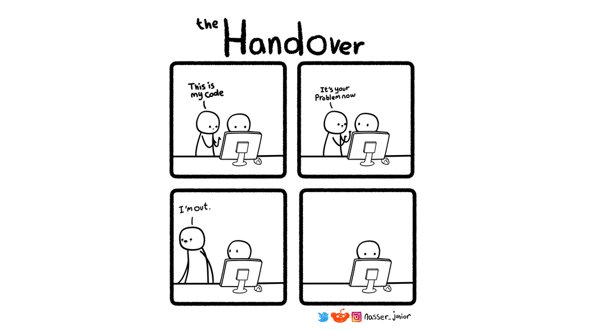

Coding is fairly similar to art: it can require attention to detail from the crafter, but it also necessitates a standard that ensures the work is accessible and maintainable for others. In the same way an artist follows principles of composition and color theory, a developer must comply with such standards in order to transform raw logic off their head into something magnificent if done well. The discipline fosters a collaborative environment where every contributor can understand and build upon the existing foundation without confusion from the former. No one in this world thinks and does the same as the other; rather, they are entitled to their own traits and flairs. Hence, there should (or must for the better) exist a set of guidelines that helps developers alike to lead them to develop their products.

## Leave a good impression for all readers, including yourself!

Before I chose to walk on this path I am on today, I had experienced programming in an environment without any basic standards. At the time, everything felt like a breeze and was something that I could enjoy doing for hours everyday. My code at the time doesn’t have lots of comments, but when there are some, they often have values close to nothing. I could care less about the massive lines of instructions that are like scramble eggs. I didn’t mind that much about the neatness of those lines, as I know whatever works on my end would always end there and almost never look back again for mistakes. It is so obvious that my ignorance was a big bliss to me. But after heading to school for my major, I realized that I may not be able to keep up with my code if I keep continuing to write code as I used to earlier in my life. 

I was able to recognize what it means to have standards in programming.

Treat coding like a form of literature: not only make a good use of syntax, structure, or semantics, but also the purpose (message) it is capable of bringing — is a great lesson I learned off my fellow friend and coder, who’s now graduated by the time I am writing this. I took it with pride to all my projects since, realizing that clear documentation was essential for long-term understanding of my work. It narrates me through the gist of exhaustive information of my code, in a coherent yet simple explanation. For my peers who want to improve their talent, having a look at my code, with all of the standards followed, would benefit them with loads of valuable information that can last them for years to come. Do I enjoy it? Yes, but it can get repetitive if I have loads of functions and variables. Will I use this ever again in my career? Absolutely yes. It would be a shocker to say no to it. Do I expect everyone to follow it? Yes because I want to enjoy the behind-the-scenes operations of the project, and for them to adhere pleases me a lot.

