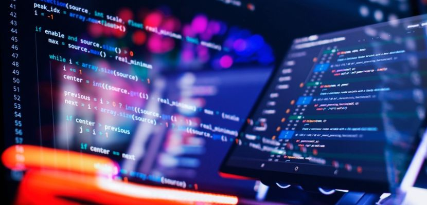

## Best Friends with the Web
Ever since I sparked an interest in computers, I have held an ambition to utilize them for the betterment of the future, not only for myself but for all people and generations to come. This journey did not begin with coding tutorials on YouTube, but with a fascination for the websites I visited daily. Watching how seamlessly they loaded within my 3-count, lightened a curiosity that quickly evolved into a deeper desire to understand the "behind-the-scenes”. I am continuously impressed by the vast capabilities of software engineering. From simple tasks like changing landing pages based on user interactions, to more complex functions like handling a massive user base or constantly updating information in real-time while the user is away, they have all impressed me.

## My Fears and Ability Before Software Engineering
Software engineering really does influence lots of people with its capability to provide users a comfortable experience on a grand scale, and I want to take part in that race. Yet, I don’t see myself to be good enough to consider myself a self-reliable programmer, and feeling it sparks up a fire in me to drive me forward to become one eventually. Partaking in this field means that I am responsible for the creation, development, and maintenance of my projects and contributions, and I need to be able to achieve all three if I want to succeed. There is a presence of fear and jealousy in myself of seeing peers around my age being able to create countless projects, while I’m sitting here writing of how I am jealous about them because I certainly am far from today’s standard in terms of abilities. And with the rise of AI, the standard will keep rising for a very long while.

No matter how quickly or slowly I learn new concepts, I often struggle to apply them in practice. There were times where I, as a growing developer, find myself staring at the screen, doing nothing while searching for the “most correct” line of reasoning, while my mind feels void and blank. And even when an idea finally sparks, it fades just as fast. That might come from a fear of speaking up, a fear of having my ideas dismissed, a fear of falling behind, a fear of not being good enough, or countless other reasons I can’t fully name yet. No employer wants a heavy boulder that stops them from progressing, and I agree, I do not want to be a heavy boulder of any group. Overcoming these hurdles requires more than just better coding; it necessitates a growth in how I engage with others. 

## Importance of Personal Skills

It is obvious from my fears that interpersonal skills do matter as much as technical skills. I am about 4 semesters away from graduating, and everyday that passes by, it crosses out the days I have remaining. The market now does not take in as many aspiring developers like me as years ago, and only the best of the bunch get their chance to shine. Being “good enough” is now a thing of the past, and they are looking for that “shine factor”. I am not going to argue whether software engineering would be the solution to take off my fears, but in a search for that “shine factor”, it can help me get around many obstacles. I must be able to lead, to control, understand myself and others, to be more vocal, and to be a team player and not act selfish. And how I will act and react to those will be known altogether by what comes ahead in my journey as a developer.

