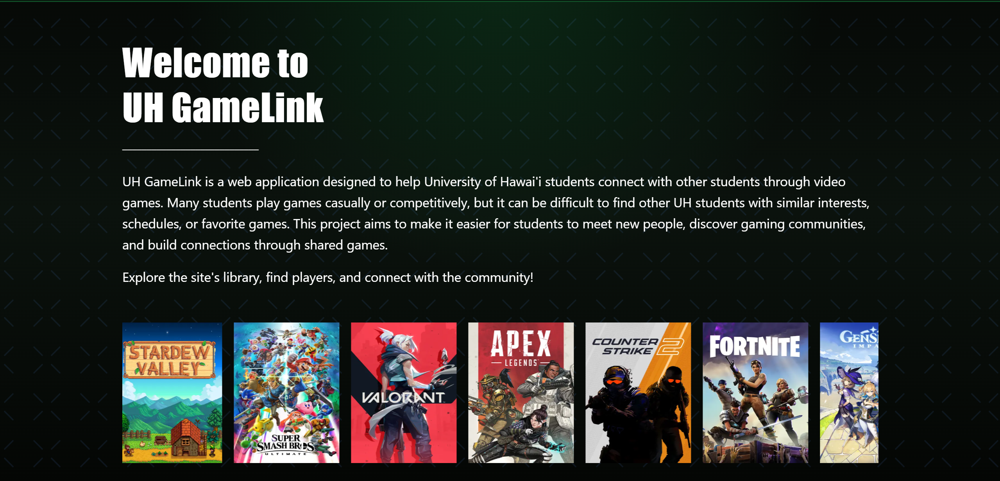

## About the Project

UH GameLink is a website dedicated to connect students of University of Hawai'i at Manoa through video games. This project aims to make it easier for students to meet new people, discover gaming communities, and build connections through shared games.

In addition to the landing and profile pages, the application features a catalog of games of various genres, a Community page with directories for game-specific and UH-affiliated Discord servers, a Find Players page, a Report Player page, and a Review page. Students and users alike can create their own profiles, add and remove games to and from their favorites, connect with fellow gamers, report users of bad intentions, and send feedbacks to the developers. The website also has a version for the administrator, where their role is to manage players, games, and communities, and review any reports if exist. The whole application was built on a provided template from the class ICS 314, using Next.js, React and Bootstrap 5 written in Typescript, and Primsa and PostgreSQL to handle our database, and Vercel to deploy the application to the public.

## Reflect on my Role

For my part, I helped out on building elements on both the front and back ends. On the frontend, I developed, implemented, and adjusted various UI elements across many pages. While on the back, I established an interface that is easy for the Administrator to navigate and handle the behind-the-scenes, directly on the page. I felt I had effectively contributed to my team, even if my schedule did not allow me to work on more tasks as I aspired to. Sometimes I happen to make beginner's mistakes like forgetting to pull origin before pushing my code, leading to various errors and duplicates that I didn't want; but as time goes on, after each task, I felt more comfortable with pushing mine and pulling my teammates' codes. I'm pleased with the final product, despite there are still rooms for improvements, given the time period we all had, I believe we all tried our best. 

Looking back, the project taught me various skills outside of coding, such as project & task management, using Github, design patterns, and various more. However, I did not perform as good at communicating with my teammates, even through Discord, and I blame nobody but myself for that. This is my first proper project, and seeing all the goods and bads during development, I hope that I can keep improving on my technical attributes and minimize the negatives I carry with in my journey ahead. 

<a href="https://uh-gamelink.github.io/">Project's Github page</a>

<a href="https://uh-gamelink.vercel.app/">Deployed Application</a>

<h6><i>Composed on 05/15/2026</i></h6>
